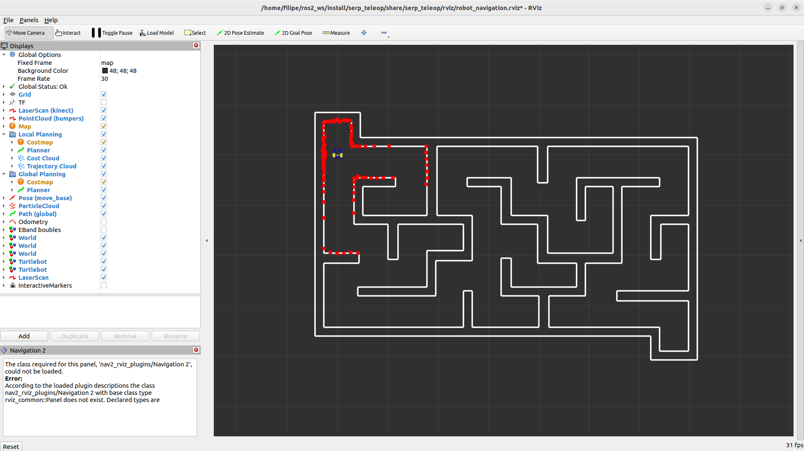

# Flatland Teleopkeys Tutorial using ROS 2

This tutorial will show you how it is possible to use ROS 2 and the Flatland Simulator to create a simulated world with a robot and how to control it using the keyboard. It also briefly explains how these tools function but, if you wish to learn more about them, please visit the [ROS 2 Documentation](https://docs.ros.org/en/humble/) and the [Flatland Documentation](https://flatland-simulator.readthedocs.io/en/latest/). All the code in this tutorial is written in python.

# Setup and Pre-requisites

## ROS 2 Humble Installation

This tutorial was built to work with ROS 2 Humble which is, at the time of writing, the latest distribution. Follow the instructions in the official [ROS 2 installation guide](https://docs.ros.org/en/humble/Installation.html). 
It is recommended to at least install the desktop version, as some tools that will be used here are already contained within.

## Flatland 2

A fork of Flatland modified to work on ROS 2 natively is available on [this repository](https://github.com/JoaoCostaIFG/flatland). Follow the installation instructions to have this version available on your machine.

## Workspace setup

To be able to build all the dependencies and run your projects, ROS needs a designated folder known as the workspace. To setup your workspace follow the oficial [ROS 2 tutorial on how to create a workspace](https://docs.ros.org/en/humble/Tutorials/Beginner-Client-Libraries/Creating-A-Workspace/Creating-A-Workspace.html).

# Clone the repository

After everything is setup, run the following commands inside your ROS 2 workspace folder to clone this repository as a package:

```
cd src/
git clone https://github.com/FilipeAlmeidaFEUP/ros2_teleopkeys_tutorial.git
```

# Building and installing dependencies

Before running the package for the first time, you need to execute all these commands:

1. Resolve dependencies:`rosdep install -i --from-path src --rosdistro humble -y`
2. Build the workspace:`colcon build`
3. Source the setup script:`source install/setup.bash`

After the first run, these commands might be useful for this or any other package in your workspace:

- For every new terminal that you open that accesses the workspace, run command 3.
- If you made changes in any file of any package, you need to either build the entire workspace with command 2 or use the same command with [arguments](https://colcon.readthedocs.io/en/released/reference/package-selection-arguments.html) to build only specific packages.
- If there are new dependencies on any of your packages (ex.:new python imports), you should run command 1 to make sure all of them are resolved.
- If you are creating a new package or cloning one, run all the commands.

# Running the package

Once everything is built, running the package can be done with the command:
```
ros2 launch serp_teleop serp_teleop.launch.py
```

If everything worked as intended, you should be seeing a window that looks like this:



Right now you are seeing the robot move inside the map built for this package but, although the space is not being used, the world extends beyond the walls on the screen. To navigate through the flatland world use these mouse controls:

- Scroll button + drag: move the window.
- Scroll up/down: zoom in/out.
- Left click + drag: rotate the window.

The window on the left called Displays allows you to control some aspects of the visualization. For example, try to unselect the checkbox called `LaserScan (kinect)`. Once you do, the red squares around the robot will disappear. These squares were representing the collisions from the robots radar with the walls. Turning this off does not mean the radar is no longer working, only that it is not appearing in the visualization.

For now, the robot can not be controlled with the keyboard. It moves forward until it detects a wall in front of it using its radar. When a wall is detected, it randomly chooses one direction to rotate 90º, essentially following a random path. The next section will briefly explain how a Flatland ROS 2 package is structured. If you wish to skip this part and go directly to the keyboard control, go to [this section](#keyboard-control).

# The Flatland ROS 2 package

## ROS 2

To help you understand the structure of ROS, take a quick look in the documentation sections [Nodes](https://docs.ros.org/en/humble/Tutorials/Beginner-CLI-Tools/Understanding-ROS2-Nodes/Understanding-ROS2-Nodes.html), [Topics](https://docs.ros.org/en/humble/Tutorials/Beginner-CLI-Tools/Understanding-ROS2-Topics/Understanding-ROS2-Topics.html) and [Services](https://docs.ros.org/en/humble/Tutorials/Beginner-CLI-Tools/Understanding-ROS2-Services/Understanding-ROS2-Services.html). You don't need to perform any of the tasks, just read the first few sections in each and watch the animations that are provided.

### Launch file

ROS 2 provides the `run` run command that starts one node but, in some cases, like in this package, you might want to start several nodes at once. To do that you can use a launch file such as the [serp_teleop.launch.py](launch/serp_teleop.launch.py) in this repository. For more information on this type of file, consult the documentation on [creating launch files](https://docs.ros.org/en/humble/Tutorials/Intermediate/Launch/Creating-Launch-Files.html). A total of 4 nodes are launched by this file but, for now, lets focus on only 2:

- The `flatland_server` node: runs the Flatland simulation, including the robot and the world. This node has several arguments that modify the functioning of the simulator. For a more detailed explanation on these parameters go to Flatland documentation on [how to launch Flatland server node](https://flatland-simulator.readthedocs.io/en/latest/core_functions/ros_launch.html#).

- The `serp_teleop` node: runs the code in the file [\_\_init\_\_.py](serp_teleop/__init__.py) that is used to control the robot. This node needs to have an instance of the class `rclpy.node.Node` created and initialized. This can be done by:

### Using Topics and Services

Before you can use topics and services, you need an initialized instance of the `rclpy.node.Node` class. This can be achieved in several ways, such as:

1. Using `rclpy.create_node`:
```
node = rclpy.create_node('node_name')
```
2. Creating a class that inherits from the `Node` and accessing as `self` inside the class (used in this package): 
```
class NewNode(Node):
    def __init__(self) -> None:
        super().__init__("node_name")
```

Both methods are equally valid but the second one might be better to keep the code organized in more complex projects. For any other code examples in this tutorial, consider the variable `node` as an initialized instance of the `rclpy.node.Node` class.

NOTE: In the following code examples, <Msg_Type> is only a placeholder for these examples and each topic has a different format to its messages. For each case look for the proper documentation to help you.

The `flatland_server` node publishes to several topics the `serp_teleop` node needs to subscribe to. To do so, the following code is necessary for each subscription:

```
#create a subscription
node.create_subscription(<Msg_Type>, "/topic_name", handling_function, queue_size)

#each time a message is published, this function is executed and the arg data is the message as a Msg_Type instance
def handling_function(data):
    [...]
```

The `flatland_server` also subscribes to some topics the `serp_teleop` node will publish to. The following code shows how a message can be subscribed to a topic:

```
#create a publisher
node.pub:Publisher = self.create_publisher(<Msg_Type>, "/topic_name", queue_size)

#call this function to send a message to the topic
msg = <Msg_Type>()
publisher.publish(msg)
```

The `serp_teleop` node also needs to use [Flatland services](https://flatland-simulator.readthedocs.io/en/latest/core_functions/ros_services.html#). This code sends a request to a service:

```
client = node.create_client(<Msg_Type>, "/service_name")
client.wait_for_service()
request = <Msg_Type>()
client.call_async(request)
```

ROS 2 provides several commands to help you see details about every communication between nodes inside the ROS 2 platform. With the package running, you can experiment with the following commands:

1. List of active nodes/topics/services:
```
ros2 node list
ros2 topic list
ros2 service list
```

2. Information about all subscribers,publishers and services (servers and clients) of an active node:
```
ros2 node info node_name
```

3. Print all messages published to a topic:
```
ros2 topic echo topic_name
```

### RViz file

The window that contains the Flatland worl is configured by the RViz plugin, [a visualization tool for ROS](https://github.com/ros2/rviz) in the [robot_navigation.rviz](rviz/robot_navigation.rviz) file. To keep things simple, you can keep this file mostly unchanged, except when you need to add a new model or a new layer to your world (more about Flatland models and layers in the [next section](#flatland)). Inside the list `Visualization Manager/Displays` you need the entries:

``` 
# for each model in the world
- Class: rviz_default_plugins/MarkerArray
  Enabled: true
  Topic:
    Value: /models/m_<model_name>
  Name: Turtlebot
  Namespaces:
    "": true
  Queue Size: 100
  Value: true
  
# for each layer in the world
- Class: rviz_default_plugins/MarkerArray
  Enabled: true
  Topic:
    Value: /layers/l_<layer_name>
    Depth: 1
    History Policy: Keep Last
    Reliability Policy: Reliable
    Durability Policy: Transient Local
  Name: World
  Namespaces:
    "": true
  Queue Size: 100
  Value: true
```

Athough there is no influence in the physics component of simulation, if a model/layer is not added to this list, it won't appear in the visualization. Some other possible changes to this file are signaled in the file through comments.

### Other setup files

Although most setup files don't require a lot of attention and are very simple, there are some configurations that you need to check in your packages.

One of them is to check that you have all the dependencies in the [package.xml](package.xml) file. 

You also may need to pay some attention to the [setup.py](setup.py) file. To help you build this file in future packages look at the example with comments on this project or for a more detailed explanation go to the [guide on how to develop a ROS 2 python package](https://docs.ros.org/en/humble/How-To-Guides/Developing-a-ROS-2-Package.html#python-packages).

## Flatland

Flatland configures its worlds through the use of YAML files. These files follow a simple structure that should be simple to understand just by looking at the examples provided in this repository. If you need any extra help, take a look at the [YAML Syntax](https://docs.ansible.com/ansible/latest/reference_appendices/YAMLSyntax.html).

### World file

The [world.yaml](world/world.yaml) file is where the Flatland world is configured and is sourced directly by the launch file. 

To understand this file, you need to be familiar with the concept of layers. This makes Flatland essentially a 2.5D simulator since each layer can contain different components of the world that work independently in terms of physics. This means objects in different layers won't collide with each other. The world file can configure up to 16 layers and each of them is configured in their [own file](#layer-file). 

There is also a list of models that are included in the world. Each one needs a name, the initial position and their [own configuration file](#model-file)

For more information on how to configure this file go to the [configuring world page](https://flatland-simulator.readthedocs.io/en/latest/core_functions/world.html) of the documentation.

### Layer file

In this package there is only one layer, configured in the file [maze.yaml](world/maze.yaml). This configuration works by taking an image ([maze.png](world/maze.png)) and using a threshold to turn it into a binary image. It then builds a map by placing walls where the image transitions from 0 to 1 or 1 to 0.

Another possible configuration for this file is to manually define line segments in a .dat file and use it to define the walls of the map.

For more information on how to configure this file go to the [configuring layers page](https://flatland-simulator.readthedocs.io/en/latest/core_functions/layers.html) of the documentation.

### Model file

Each model needs their own configuration file. In this package you can look at the example from the SERP robot simulation model in the file [serp.model.yaml](world/serp.model.yaml).

This file starts by defining a list of bodies with predefined shapes or customizable polygons that create the shape of the model. It can also have a list of joints to connect the bodies.

For the model to interact with the world, it needs to configure a list of plugins. Flatland offers several built-in plugins that usually interact with topics. Of those, the SERP model uses:

- [Bumper](https://flatland-simulator.readthedocs.io/en/latest/included_plugins/bumper.html). Detects collisions and publishes them to a topic using [flatland_msgs.msg.Collisions](https://flatland-simulator.readthedocs.io/en/latest/included_plugins/bumper.html).

- [Diff Drive](https://flatland-simulator.readthedocs.io/en/latest/included_plugins/diff_drive.html). Subscribes to a topic that receives [geometry_msgs.msg.Twist](http://docs.ros.org/en/api/geometry_msgs/html/msg/Twist.html) that modify the models velocity.

- [Laser](https://flatland-simulator.readthedocs.io/en/latest/included_plugins/laser.html). Simulates a LiDAR sensor and publishes the readings to a topic using [sensor_msgs.msg.LaserScan](http://docs.ros.org/en/api/sensor_msgs/html/msg/LaserScan.html).

For more information on how to configure this file go to the [configuring models page](https://flatland-simulator.readthedocs.io/en/latest/core_functions/models.html) of the documentation.

# Keyboard control

Now it's time to control the robot using the keyboard. Although it is possible to read keystrokes and control the robot all inside the same node, ROS works better if we keep things modular. We'll try to have another node running in parallel reading keyboard inputs and publishing them to a topic.

You can already find a ready to use package to do that in [this repository](https://github.com/FilipeAlmeidaFEUP/ros2_teleopkeys_publisher). You can follow the instructions there to get it running. It's a very simple package so you can inspect it later and figure out how it works but, for now, all you need to know is that it reads keystrokes from certain keys and it publishes them to the topic '/teleopkeys' as messages of the type [String](http://docs.ros.org/en/noetic/api/std_msgs/html/msg/String.html). Here's the [list of available keys and the messages they produce](https://github.com/FilipeAlmeidaFEUP/ros2_teleopkeys_publisher#available-keys).

Once you have the keyboard reading node running, you need to go to the [\_\_init\_\_.py](serp_teleop/__init__.py) file and change this variable to `True`:
```
# if you didn't change anything, this is on line 21
self.use_keyboard = False
```
 
This will change the flow of the code so that it now will read from the topic '/teleopkeys' and control the robot accordingly. Now all you need to do is to open a new terminal and run the Flatland world again. However, before that, do not forget that you might need to run some of the commands from [this section](#building-and-installing-dependencies) again.

If everything is working, you should be able to control the robot using the arrow or the WASD keys. All the plugins are still being used. If you get too close to a wall, a warning message appears on the terminal and the robot moves slower. If you collide with a wall you go back to the original position.
